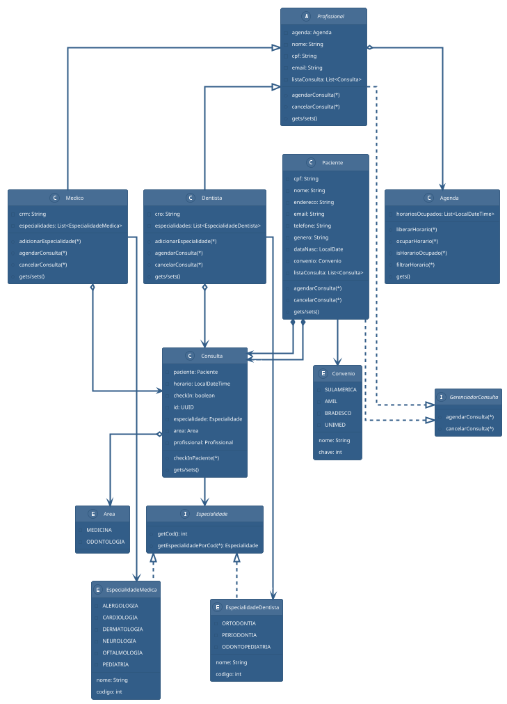

# wiseclinic-backend
Projeto Final de Programação Orientada a Objetos Back-end

O projeto consiste em um sistema de consultas de uma clínica médica/odontológica, em que é possível:

- Agendar Consultas;
- Cancelar Consultas;
- Listar Consultas;
- Realizar check-in do Paciente na Consulta.

Para isso, foi criada uma API seguindo o padrão REST em Java utilizando o framework Spring Boot, que permite a criação de endpoints HTTP. A interface gráfica foi feita utilizando tecnologias como TypeScript e React para a composição das telas da aplicação.

Abaixo, segue a estrutura de classes utilizada para o sistema:

### Diagrama de classe UML

