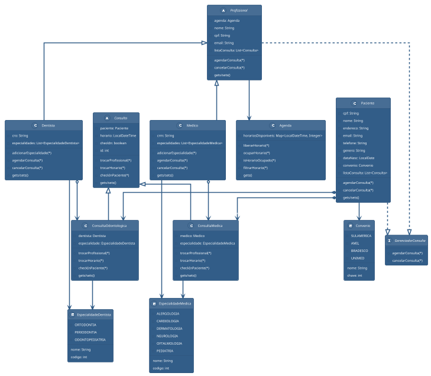

# wiseclinic-backend
Projeto Final de Programação Orientada a Objetos Back-end

### Diagrama de classe UML

```plantuml
@startuml
    scale 700 width
    skinparam linetype ortho
    !theme sandstone

    class Paciente{
        - cpf: String
        - nome: String
        - endereco: String
        - email: String
        - telefone: String
        - genero: String
        - dataNasc: LocalDate
        - convenio: Convenio
        - listaConsulta: List<Consulta>
        + agendarConsulta(*)
        + cancelarConsulta(*)
        + gets/sets()
    }

    abstract class Consulta{
        -paciente: Paciente
        -horario: LocalDateTime
        -checkIn: boolean
        -id: int
        +trocarProfissional(*)
        +trocarHorario(*)
        +checkInPaciente(*)
        +gets/sets()
    }

    class ConsultaMedica{
        -medico: Medico
        -especialidade: EspecialidadeMedica
        +trocarProfissional(*)
        +trocarHorario(*)
        +checkInPaciente(*)
        +gets/sets()
    }

    class ConsultaOdontologica{
        -dentista: Dentista
        -especialidade: EspecialidadeDentista
        +trocarProfissional(*)
        +trocarHorario(*)
        +checkInPaciente(*)
        +gets/sets()
    }

    abstract class Profissional{
        -agenda: Agenda
        -nome: String
        -cpf: String
        -email: String
        -listaConsulta: List<Consulta>
        +agendarConsulta(*)
        +cancelarConsulta(*)
        +gets/sets()
    }

    class Dentista{
        -cro: String
        -especialidades: List<EspecialidadeDentista>
        +adicionarEspecialidade(*)
        +agendarConsulta(*)
        +cancelarConsulta(*)
        +gets/sets()
    }

    class Medico{
        -crm: String
        -especialidades: List<EspecialidadeMedica>
        +adicionarEspecialidade(*)
        +agendarConsulta(*)
        +cancelarConsulta(*)
        +gets/sets()
    }

    class Agenda{
        -horariosDisponiveis: Map<LocalDateTime, Integer>
        +liberarHorario(*)
        +ocuparHorario(*)
        +isHorarioOcupado(*)
        +filtrarHorario(*)
        +gets()
        
    }

    interface GerenciadorConsulta{
        + agendarConsulta(*)
        + cancelarConsulta(*)
    }

    enum Convenio{
        -SULAMERICA
        -AMIL
        -BRADESCO
        -UNIMED
        __
        nome: String
        chave: int
    }

    enum EspecialidadeMedica{
        -ALERGOLOGIA
        -CARDIOLOGIA
        -DERMATOLOGIA
        -NEUROLOGIA
        -OFTALMOLOGIA
        -PEDIATRIA
        __
        nome: String
        codigo: int
    }

    enum EspecialidadeDentista{
        -ORTODONTIA
        -PERIODONTIA
        -ODONTOPEDIATRIA
        __
        nome: String
        codigo: int
    }


    Profissional <|-- Medico
    Profissional <|-- Dentista

    Consulta <|-- ConsultaOdontologica
    Consulta <|-- ConsultaMedica

    Profissional ..|> GerenciadorConsulta
    Paciente ..|> GerenciadorConsulta

    Paciente --> "0..1" Convenio
    Paciente *--> "0..*"  ConsultaMedica
    Paciente *--> "0..* " ConsultaOdontologica

    Medico o--> "0..* " ConsultaMedica
    Dentista o--> "0..*" ConsultaOdontologica

    Medico --> "1..*" EspecialidadeMedica
    Dentista --> "1..*" EspecialidadeDentista

    ConsultaMedica --> EspecialidadeMedica
    ConsultaOdontologica --> EspecialidadeDentista

    
    Profissional --> "1" Agenda

}
@enduml
```

